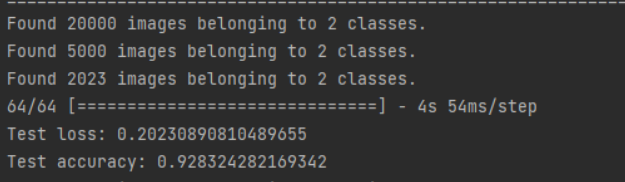
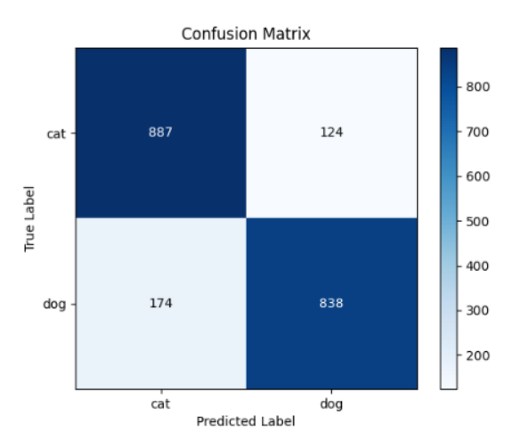
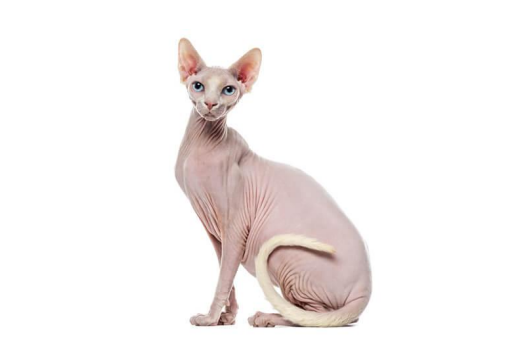
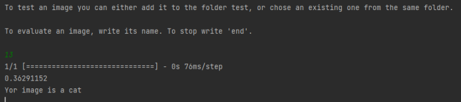

# Cats-vs-Dogs
This repository contains a Python implementation of a neural network image classifier that distinguishes between images of cats and dogs. The model is built using a Sequential model from the Keras library and can be trained on a dataset of labeled cat and dog images.

## Evaluation

